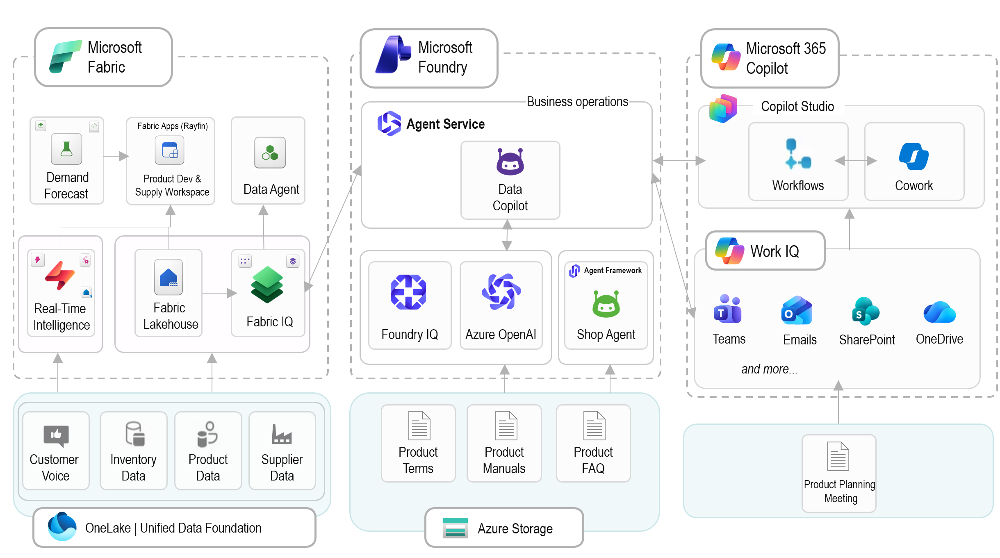
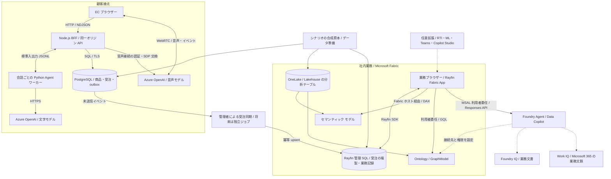

# Microsoft IQ Solution Accelerator Extended

## サマリー



日本市場向けの「舞黒珈琲店 / Micro Coffee」を題材に、他社・他業種へ展開できる業務デモを提供する独立したプロジェクトです。顧客接点の EC と、顧客の声・商品開発・供給を扱う業務アプリをつなぎ、データ、業務文書、過去の判断を参照しながら意思決定を支援します。

採用する構成は **2 アプリ + 受注同期 + 業務シナリオ + クラウド定義** のモノレポです。EC を単なる画面、Rayfin を全機能のバックエンドとは扱いません。EC は独自の API と Agent ワーカーを持ち、Rayfin 側は業務画面と管理 SQL を持つ別アプリです。両者の認証、データの正本、配置先を維持したまま、一つのリポジトリで提供します。

**現在の状態: 2 アプリのソース移植と親リポジトリ依存の除去は完了しました。** EC の画面・Express API・Python Agent、業務画面・Rayfin 定義・DAX / Graph / Foundry / RTI クライアント、独立した受注同期を配置しています。両アプリを移植先から起動し、ブラウザーで EC と業務画面の表示を確認しました。世界銀行の公開コーヒー価格 144 件と合成業務教材も同梱しています。

**構築の入口は [元データで構築してデモを実演する](docs/end-to-end-setup.md) です。** データ準備、Lakehouse / Ontology / Graph、Semantic Model、PostgreSQL の作成と権限、Rayfin の初期業務データ、受注同期、Foundry/IQ の作成・接続、アプリ起動、デモ進行までを順につないでいます。元の予測スナップショット・ML 入力・RTI 定義も追加収録し、由来のハッシュを保存しました。実際のクラウド構築は今回実施していません。

確認済みなのは依存導入、開発サーバー起動、ブラウザー表示、Agent API の未設定応答、エディター診断です。クラウドへの再配備、実 Agent 推論、PostgreSQL の注文保存、受注同期、DAX / Graph / IQ / RTI の実接続は未確認です。指示に従い、CLI によるテスト・型チェック・本番ビルドは実行していません。以下は 2026-09-28 時点の状態です。

## 2 アプリを起動する

このディレクトリ全体を単独リポジトリとして使用します。親の Ontology Playground は不要です。Node.js 22.12 以上を用意し、このディレクトリで実行します。

```powershell
npm run setup:apps
npm run dev:storefront
```

別のターミナルで `npm run dev:operations` を実行します。通常の入口は EC が `http://127.0.0.1:5180/shop`、業務画面が `http://127.0.0.1:4186/` です。使用中なら起動ログに表示された別ポートを使用します。終了は各ターミナルで Ctrl+C です。

未設定でも合成商品と業務画面を閲覧できます。DB 保存・AI 応答をローカルで模擬する設定ではありません。接続設定、Python Agent の導入、PostgreSQL 初期投入、Rayfin 配備は [EC 手順](apps/storefront/README.md)、[業務手順](apps/operations/README.md)、[受注同期](services/order-sync/README.md) を参照してください。各アプリの `.env.example` を同じディレクトリの `.env` として設定します。元環境の設定や秘密情報はコピーしていません。

## デモを実演する

[舞黒珈琲店 デモ実演マニュアル](scenarios/micro-coffee/demo/README.md) を使用します。約 25 分で EC、顧客の声、商品開発、供給と注文、IQ による判断根拠の照合を案内する台本です。開始準備、画面操作、話す内容、数値の期待値、質問文、未接続・障害時の進行、終了時の復元を含みます。

ローカル版と実接続版を区別し、公開実データの出典を示す追加説明も用意しています。台本作成は完了していますが、新環境でのクラウド接続を含む通し実演は未確認です。

## データ基盤から始める

データ基盤 CLI の詳細は [構築・配備・復旧の手順書](docs/data-foundation.md) です。基本は 26 テーブル、元の予測を含む標準構築は `--include-predictions` で 29 テーブルです。公開価格を加えると、それぞれ 27 / 30 テーブルになります。後続サービスへの接続は [全体手順](docs/end-to-end-setup.md) に戻って続行します。

| 処理 | 実装と内容 |
| --- | --- |
| 公開実データの取得 | [scripts/import_public_prices.py](scripts/import_public_prices.py)。公式配布元、期間、単位、利用条件、SHA256 を記録 |
| データ準備と配備 | [scripts/deploy.py](scripts/deploy.py)。`prepare` → `plan` → `apply`、`resume` / `status` / `record-operation` |
| アプリ向け初期準備 | [scripts/prepare_application.py](scripts/prepare_application.py)。元データの Rayfin seed SQL、元指示の Foundry Agent 作成要求をローカル生成 |
| 環境入力 | [config/fabric.example.json](config/fabric.example.json)。元環境の ID や秘密情報を既定値にしない |
| 自動化 | [.github/workflows/data-foundation.yml](.github/workflows/data-foundation.yml)。計画、保護環境での承認、OIDC 配備、状態保存 |
| 採用データ | [公開価格の意味・出典・制約](scenarios/micro-coffee/reference-data/world-bank-coffee/README.md)と、版を固定した合成原本 |

ローカル準備と計画はクラウドへ書き込みません。配備には対象ワークスペース、権限、計画ハッシュの明示的な承認が必要です。既存アイテムの採用・上書き、実データへの自動置換は行いません。取得した国際価格は独立した参照データであり、架空店舗の仕入価格や売上に置き換えません。

## 解決する業務

デモは「顧客の声を聞く → 商品を検討する → 材料・供給への影響を調べる → 根拠と判断を残す」という流れで構成します。

| 利用者 | 体験 | 判断の材料 |
| --- | --- | --- |
| EC の利用者 | 商品の比較、文字・音声による相談、店舗受取の注文 | 商品・店舗・価格・好み |
| 商品企画担当 | レビューなどの原文を確認し、配合案を比較 | 顧客の声、設計規則、原価、共有原料 |
| 供給担当 | 入荷・受注・需要見通し・供給停止の影響を確認 | 受注、供給関係、確認済み在庫、予測 |
| 部門横断の検討者 | 現在の数値と、過去の見送り理由・変更された規則を照合 | Fabric IQ、Foundry IQ、Work IQ の接続先 |

最初のシナリオは Micro Coffee に限定します。横展開は店名の置換だけではなく、商品・単位・業務規則・オントロジー・根拠文書・実演台本をまとまった単位で差し替える設計です。異業種の実装済みシナリオや、全業種共通の業務エンジンはまだありません。

## 全体アーキテクチャ

次の図は、既存実装で確認できた主要経路を、移植先の責務に対応付けたものです。破線は任意接続または将来の整備対象です。



重要なのは、**受注保存、分析更新、グラフ更新を一つのトランザクションとみなさないこと**です。既存 EC は PostgreSQL に受注・明細・outbox を同時保存します。その後、同期処理が Rayfin 管理 SQL に反映します。Lakehouse、セマンティック モデル、GraphModel が、この同期だけで自動更新される構成ではありません。

Data Copilot は現在、業務ブラウザーから Foundry の Responses API を直接呼び出します。Rayfin Functions を経由する設計ではなく、入力側の Rayfin 設定でも Functions は無効です。EC の Python Agent と Data Copilot も、異なる実行経路・セッションです。

## ディレクトリ構成

データ基盤、シナリオ原本、2 アプリ、受注同期は実ファイルを配置済みです。クラウド資源のうち未実装の自動作成は、各領域の README と TODO で区別しています。

```text
microsoft-iq-solution-accelerator-extended/
|-- README.md
|-- TODO.md
|-- .gitignore
|-- apps/
|   |-- storefront/              EC の React + Node.js + Python ワーカー
|   `-- operations/              業務 React + rayfin/ のスキーマ・配備設定
|-- services/
|   `-- order-sync/              PostgreSQL outbox から Rayfin への同期
|-- packages/                   実際に共有できる型・検証・接続処理の抽出先
|-- scenarios/
|   `-- micro-coffee/             合成原本・意味定義・文書・公開価格
|-- infra/
|   |-- azure/                   EC の実行基盤・PostgreSQL・認証
|   |-- fabric/                  Lakehouse・Semantic Model・Ontology・RTI・ML
|   `-- foundry/                 Agent・検索・IQ 接続の配備定義
|-- integrations/
|   `-- microsoft-365/            Work IQ 接続条件・任意の Teams/Studio 連携
|-- config/                     環境入力・公開可能設定・秘密情報の境界
|-- scripts/                    原本移植・価格取得・準備・計画・配備・再開
|-- docs/                       データ基盤・構築手順・出典記録
`-- .github/
    `-- workflows/              データ基盤の手動開始・承認付き配備
```

| 配置先 | 設計上の役割 |
| --- | --- |
| [apps/storefront/README.md](apps/storefront/README.md) | EC を単独起動できる単位のまま移植 |
| [apps/operations/README.md](apps/operations/README.md) | 業務画面と Rayfin の生成・配備の基準ディレクトリを維持 |
| [services/order-sync/README.md](services/order-sync/README.md) | アプリ横断の同期を UI のライフサイクルから分離 |
| [packages/README.md](packages/README.md) | 重複が確認できた処理だけを共有化 |
| [scenarios/micro-coffee/README.md](scenarios/micro-coffee/README.md) | 業務固有部分を一括で交換できる単位を定義 |
| [infra/azure/README.md](infra/azure/README.md) | Azure 側の資源と権限 |
| [infra/fabric/README.md](infra/fabric/README.md) | 分析・オントロジー・任意の予測やリアルタイム処理 |
| [infra/foundry/README.md](infra/foundry/README.md) | Agent と検索接続の再現性 |
| [integrations/microsoft-365/README.md](integrations/microsoft-365/README.md) | Microsoft 365 を使う場合だけ必要な接続と権限 |
| [config/README.md](config/README.md) | 環境固有値の外出しと生成物の管理 |
| [scripts/README.md](scripts/README.md) | 実行順序、再実行、途中失敗からの再開 |

## データと認証の境界

| 対象 | 正本・実行主体 | 公開・移植時に維持する境界 |
| --- | --- | --- |
| 商品・注文 | EC の PostgreSQL。ローカル表示用の合成カタログは別 | 金額をサーバーで再計算。Rayfin 側は同期済みの複製 |
| 分析・予測 | Lakehouse とセマンティック モデル | 分析基準日時・更新日時・合成データであることを明示 |
| 意味と関係 | シナリオの意味定義と配備済み Ontology / GraphModel | 関係があることと因果関係・引当可能性を区別 |
| 判断・仮定 | 業務アプリの保存記録、ブラウザー内の試算 | 保存済み記録と正式な製造指図・実在庫更新を区別 |
| EC の AI 資格情報 | Node.js 側の認証設定 | 秘密情報をブラウザー設定や配信資産に含めない |
| Rayfin / DAX | Fabric 利用者とポータルのホスト経由の認証 | 顧客向け EC に社員の Fabric セッションを流用しない |
| Graph / Data Copilot | MSAL による利用者委任 | 個別の API 権限、同意、リダイレクト URI を管理 |
| 業務文書 | 接続先ごとのアクセス制御 | 静的資産に実顧客情報・社内文書を同梱しない |

現在のブラウザー保存やデモ用注文 API は、本番の顧客認証、所有者別認可、監査、保持期間管理を完成させた仕組みではありません。人による確認を経ずに実注文・実在庫・外部通知を変更する機能は、初期公開版の対象にしません。

## 横展開の方法

共通化するのは、データ読込、入力検証、根拠の提示、関係探索、試算、保存、画面操作ツールの実行という仕組みです。コーヒーの配合率、円価格、豆の重量、VIP 条件などを共通処理に埋め込みません。

1. 新しいシナリオの利用者、判断したい問い、確認すべき根拠を決めます。
2. 商品・拠点・材料などの ID、単位、欠損、金額・税の計算規則、時刻の扱いを定義します。
3. 合成原本、オントロジー、根拠文書、Agent の業務指示、期待結果をシナリオとして追加します。
4. PostgreSQL、Rayfin、Lakehouse それぞれへの変換と、必要な接続だけを選択します。
5. 空の別環境で再現し、権限不足・未設定・同期失敗時に合成結果へ自動置換しないことを確認します。

この差し替え機構はこれから実装します。まず Micro Coffee を単独リポジトリで再現し、次の一業種を追加するときに必要な共通部品を確定します。

## 導入段階

アプリとデータ基盤の CLI は実装済みです。ローカル閲覧の先は [全体手順](docs/end-to-end-setup.md) のコマンドとポータル操作で構築・接続します。全サービスを一度に新規作成する自動配備ではありません。

| 段階 | 含めるもの | 必要な外部環境 |
| --- | --- | --- |
| ローカル閲覧 | 合成データによる EC の商品比較と業務画面 | Node.js。クラウド AI・注文保存は含めない |
| EC 接続 | 商品・受注保存、文字相談、任意の音声相談 | PostgreSQL、対応する Azure モデル、文字相談には Python |
| 業務データ接続 | Rayfin、Lakehouse、DAX、Graph、受注同期 | Fabric 容量・ワークスペース・利用者権限 |
| IQ 接続 | Data Copilot、文書検索、任意の Work IQ | Foundry、検索接続、必要な Microsoft 365 の権限・利用条件 |
| 追加機能 | RTI、ML、GPT-Live + Jev、Teams / Copilot Studio | 選択した機能ごとの追加サービス・利用条件 |

既存 EC の Node.js 要件は 22.12 以上です。両アプリは TypeScript や依存ライブラリの版が異なるため、移植時に一括で最新版へ統一せず、まず各アプリの依存を固定します。モデルのデプロイ名を製品のモデル ID と同一視しません。地域・容量・プレビューの利用可否は、実際の展開先で確認します。

新規環境の導入手順には、権限と費用の確認からデータ・意味定義・分析モデル・アプリ・IQ 接続・受入確認・停止と削除までを記載しています。クラウド利用料金は構成と実行量によるため、固定の月額や日本リージョン内での全処理完結は保証しません。

## 公開までの作業

`ontology-quest` の親依存、旧デモへの商品生成参照、同期処理の親ヘルパー探索を除去しました。アプリごとの依存版と起動単位を維持しています。公開に向けて残るのは、新環境のクラウド再現・本番ビルドの確認、権利確認、運用と顧客認証の整備です。

進捗は [TODO.md](TODO.md) を参照してください。

初期公開版は、出典を追跡できる公開実データ、合成業務教材、選択可能な実サービス接続を備える参照実装を目指します。決済、実在庫の排他的な引当、製造指図、実 EC 会話の自動収集、本番の顧客認証、通知・承認フローの完成を約束するものではありません。元デモの未接続機能を、完成済みの連携として紹介しません。

## ライセンスと出典

取り込んだ資産のライセンス本文を [docs/provenance/source-repository-LICENSE.txt](docs/provenance/source-repository-LICENSE.txt)、出典とハッシュの記録を [sources.lock.json](scenarios/micro-coffee/sources.lock.json) に保存しています。公開価格には世界銀行の CC BY 4.0 と追加条件を適用し、コードのライセンスと分けます。本リポジトリのライセンス確定、ユーザー追加資産を含む権利確認、第三者通知の整備は引き続き公開条件です。Microsoft のサービスを利用する権利は、コードのライセンスとは別です。

- Fabric のセマンティック モデル接続: https://learn.microsoft.com/en-us/fabric/apps/data-apps-template
- Fabric SSO と iframe 内の認証: https://learn.microsoft.com/en-us/fabric/apps/fabric-authentication

## 参考

- [Microsoft IQ Solution Accelerator](https://github.com/microsoft/microsoft-iq-solution-accelerator)