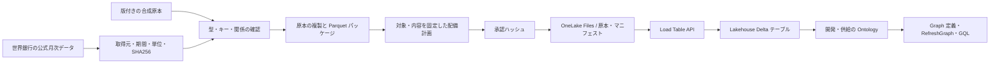

# データ基盤の構築と運用

## サマリー

この手順は、版を固定した Micro Coffee の原本から Parquet を生成し、**新規 Lakehouse の Delta テーブル、任意の Ontology / GraphModel** まで配置するものです。基本は 26 テーブル、`--include-predictions` で元の予測 3 テーブルを加えると 29 テーブルになります。世界銀行の公開価格はさらに 1 テーブルです。PostgreSQL、Rayfin、Semantic Model、Foundry、RTI、ML の再学習、アプリ本体の作成はこの CLI では行わず、[E2E 構築手順](end-to-end-setup.md) の後続工程で接続します。

公開価格の取得は実施済みです。2020 年 1 月から 2025 年 12 月まで、アラビカ・ロブスタの計 144 件を同梱しています。**新しい配備コードによる Parquet 生成・クラウド配備・GitHub Actions の実行は未確認**です。エディター診断で問題が出なかったことと、実サービスでの受入完了を区別してください。



公開価格は独立した参照テーブルです。既存の開発・供給グラフへ架空の対応関係を追加しません。

## 前提条件

| 項目 | 条件 |
| --- | --- |
| 作業位置 | この accelerator のルート。元の Playground は不要 |
| Python | 3.12 を基準とする専用の仮想環境 |
| 依存 | [固定した直接依存](../scripts/requirements.txt)。推移依存までの完全なロックではない |
| ローカル認証 | Azure CLI のサインイン。スクリプトは `AzureCliCredential` を使用 |
| Fabric | サポートされる有効な容量に割り当てた、他の書込み処理がない専用ワークスペース |
| 配備者 | 対象ワークスペースの Contributor 以上と、利用 API に必要な権限 |
| Ontology / Graph | 対象テナント・容量でプレビューが利用可能であること |
| 通信 | PyPI、Fabric REST API、OneLake。公開価格の更新時だけ世界銀行の配布元 |

Lakehouse 作成は `creationPayload.enableSchemas` を指定せず、非スキーマ型を使用します。作成結果がスキーマ対応型なら停止します。Graph 用の参照パスも `Tables/<table>` が前提です。Lakehouse の作成権限・スキーマ指定は [Create Lakehouse](https://learn.microsoft.com/en-us/rest/api/fabric/lakehouse/items/create-lakehouse)、Ontology の容量・権限・世代は [Create Ontology](https://learn.microsoft.com/en-us/rest/api/fabric/ontology/items/create-ontology) を参照してください。

REST API 用のトークンと OneLake 用の Storage audience のトークンは別に取得します。Azure サブスクリプションの Contributor 権限だけでは Fabric ワークスペースの権限になりません。[OneLake の認証](https://learn.microsoft.com/en-us/fabric/onelake/onelake-access-api)を参照してください。

## 1. ツールを準備する

PowerShell の例です。認証操作は利用者自身が端末で行い、トークンやシークレットをチャット・設定ファイルへ貼り付けないでください。

```powershell
python -m venv .venv
.\.venv\Scripts\python.exe -m pip install -r scripts/requirements.txt
az login --tenant <tenant-id> --allow-no-subscriptions
```

以降の `python` はこの仮想環境の Python を指します。アクティブ化しない場合は `.\.venv\Scripts\python.exe` に置き換えます。Linux / macOS では `.venv/bin/python` を使用します。インストールだけでもネットワーク接続が必要です。公開前には採用する環境の推移依存・配布物ハッシュを固定する作業が残っています。

## 2. データの版を選ぶ

同梱した [公開価格の説明](../scenarios/micro-coffee/reference-data/world-bank-coffee/README.md) を確認してください。通常の再現では外部サイトへ再取得せず、次の固定ディレクトリを使用します。

```powershell
$reference = 'scenarios/micro-coffee/reference-data/world-bank-coffee/202001-202512-9fdcfa8a2aed9a1b'
python scripts/deploy.py prepare --include-predictions --reference-data $reference
```

合成教材だけを配置する場合は `--reference-data` を省略します。予測も省く場合だけ `--include-predictions` を外します。予測の原本は [predictions.json](../scenarios/micro-coffee/data/predictions.json) で、shipment risk 500 行、demand forecast 2,016 行、bean depletion 4 行を明示スキーマで用意します。原本にある旧環境 ID は新環境の接続設定に採用しません。再学習・モデル登録・推論エンドポイント作成ではなく、同じ結果を表示するための固定値の投入です。

公開価格を更新する場合に限り、利用条件を確認して次の取得処理を実行します。

```powershell
python scripts/import_public_prices.py --from-month 2020-01 --through-month 2025-12 --acknowledge-terms
```

取得処理は公式ページの月次ブックを見つけ、列名と USD/kg の単位を確認します。期間内の月が不足した場合、列構造・単位が変わった場合、値が不正な場合は停止します。欠損値は補間しません。配布元による過去値の改訂も原本ハッシュの異なる版として保持します。旧版の暗黙上書きはしません。

配布ページのリンクが変わった場合は、公式の月次ブック URL を確認したうえで `--download-url` を明示します。一般の任意 URL や認証が必要なデータソースには対応しません。取得したブック全体は Git 管理外の `artifacts/downloads/`、採用した 2 系列の固定 JSON と出典記録はシナリオ配下に保存します。

## 3. パッケージを固定する

`prepare` はクラウドへアクセスせず、次を実施するコードです。

- 移植元原本の SHA256 と、選択した公開価格スナップショットの SHA256 を確認。
- 全分析行の JSON Schema、主キー、意味定義内の参照、追加の外部キー、配合率合計を確認。
- 明示した列型から Parquet を生成。日時は UTC・ミリ秒精度で、精度の黙示的な切捨てを拒否。
- 原本、生成コード、直接依存定義から内容 ID を決定。既存パッケージの内容が異なれば停止。
- テーブル別の行数、列型、主キー、データ由来、ファイル別ハッシュをマニフェストに保存。

標準出力の `package_path` が、この後の入力です。生成物の位置は `artifacts/packages/<contentId>/` です。同じ原本・コードを指すことと、異なる Python / PyArrow 環境でバイナリが常に一致することは同義ではありません。既存パッケージを再利用する場合も、マニフェストのファイルハッシュを確認します。

[sources.lock.json](../scenarios/micro-coffee/sources.lock.json) は最初の移植時の出典記録です。移植後に修正した生成コード全体の現在のハッシュ台帳ではありません。現在の生成コードはパッケージの `generatorHash`、公開価格は専用の出典記録で追跡します。原本を変更する場合は差分と権利を確認し、出典記録を版として更新してください。

## 4. 配備計画を作る

[config/fabric.example.json](../config/fabric.example.json) を基に、Git 管理外の環境ファイルへ次の 4 項目を設定します。実環境の既定 ID はありません。

| 項目 | 内容 |
| --- | --- |
| `environment` | 小文字英字で始まる 3～31 文字の英小文字・数字・ハイフン。新規配備用の名前 |
| `tenantId` | 対象テナントの UUID |
| `workspaceId` | 対象ワークスペースの UUID |
| `includeOntology` | 開発・供給の 2 Ontology と Graph を含める場合は `true` |

```powershell
python scripts/deploy.py plan --config config/environments/demo-jp.json --package artifacts/packages/<contentId>
```

`plan_path` と `plan_hash` が出力されます。計画は `artifacts/plans/<planHash>.json` に保存します。**この段階では接続先の存在・権限・名前衝突を確認していません。** それらは `apply` のクラウド側前提確認です。

承認前に、テナント・ワークスペース、作成名、各テーブルの行数と由来、選択した公開価格、任意の Graph 更新、対象外機能を確認します。容量・ストレージ・Graph の利用料金やリージョン制約は、組織の管理者と確認してください。スクリプトは容量や有料モデルを自動購入しませんが、既存容量の処理と保存を使用します。

## 5. 承認して配備する

```powershell
python scripts/deploy.py apply --plan artifacts/plans/<planHash>.json --approve-plan <planHash> --confirm-synthetic
```

公開価格を含めても店舗・受注・会話は合成なので `--confirm-synthetic` が必要です。承認済み計画やパッケージ、生成コードが変更されていた場合は停止します。

実行順序は、ワークスペース読取り → 新規 Lakehouse → 原本アップロードと読戻し → Parquet の Load Table → テーブル一覧確認 → 任意の Ontology と Graph → Graph 更新と代表エンティティの GQL 照会です。Lakehouse 内の `Files/accelerator/micro-coffee/<contentId>/` に原本・Parquet・マニフェストを配置します。[Load Table API](https://learn.microsoft.com/en-us/rest/api/fabric/lakehouse/tables/load-table) はプレビューで、Parquet からのロードが使えます。

新規作成だけを扱います。既存の同名アイテムや未管理テーブルを採用・上書きしません。作成したアイテムの ID と所有マーカーを照合してから続行します。再開のためにロードは `Overwrite` を指定しますが、完了済みのロードを再送せず、送信結果が不明な処理も自動再送しません。複数利用者が同じ Lakehouse を同時更新する運用は対象外です。

Ontology は移植元と同じ **generation 1 の JSON 定義**です。最新の API は定義を省略した作成では generation 2 を使いますが、この処理は明示的に定義を送ります。generation 2 / TMDL への変換は実装していません。[世代の扱い](https://learn.microsoft.com/en-us/rest/api/fabric/ontology/items/create-ontology)を参照してください。

Graph は新規作成前後の一覧差分から child の候補を特定し、一意でなければ停止します。その後は記録した ID だけを使います。定義の読戻しでは解決後の参照表現も確認し、Graph を更新してから GQL を実行します。[Graph 定義更新](https://learn.microsoft.com/en-us/rest/api/fabric/graphmodel/items/update-graph-model-definition)の成功だけで照会可能とは判定しません。

## 6. 結果を読む

`artifacts/deployments/<deploymentId>/` に次の内容を保存する設計です。

| 出力 | 意味 |
| --- | --- |
| `state.json` | 計画ハッシュ、所有 ID、各処理の要求ハッシュ・状態・operation ID、読戻し結果 |
| `definitions/` | 対象 Lakehouse ID を埋めた Ontology / Graph の定義 |
| `runtime.public.json` | 接続に必要な ID の許可リスト。トークンを含めない |

```powershell
python scripts/deploy.py status --plan artifacts/plans/<planHash>.json
```

`status` はローカル状態だけを読みます。リモートの最新状態や権限を確認するコマンドではありません。成功状態 `data-foundation-applied` の範囲は、原本の読戻し、ロード処理完了、テーブル名の存在、選択時の定義読戻しと代表 GQL です。

**Delta 全行の再照合、リモート行数、全エンティティ・関係の件数、利用者権限、MCP、DAX、アプリ操作は別の受入項目です。** `remoteRowCountsVerified` は `false`、`applicationReady` も `false` のままです。配備結果をアプリ接続設定の完成版として利用しないでください。

公開価格を選択した場合、SQL analytics endpoint へのテーブル反映後に、次のような読取りで件数と前年比を確認できます。以下は未実行の利用例です。投入した原本の単位は名目 USD/kg で、日本国内の小売価格や実際の仕入契約ではありません。

```sql
SELECT seriesId, COUNT(*) AS observationCount, MIN(period) AS firstMonth, MAX(period) AS lastMonth
FROM dbo.mc_ref_world_bank_coffee_prices
GROUP BY seriesId;

WITH prices AS (
    SELECT seriesId, period, [value],
           LAG([value], 12) OVER (PARTITION BY seriesId ORDER BY period) AS previousYear
    FROM dbo.mc_ref_world_bank_coffee_prices
)
SELECT seriesId, period, [value],
       100.0 * ([value] / NULLIF(previousYear, 0) - 1) AS yearOverYearPercent
FROM prices
ORDER BY seriesId, period;
```

固定スナップショットの期待件数は系列ごとに 72 件です。値が欠損している場合や前年がない場合、前年比をゼロに置換しません。国際価格の変動を、架空の受注・顧客の声の原因と断定しないでください。

## 7. 途中から再開する

```powershell
python scripts/deploy.py resume --plan artifacts/plans/<planHash>.json --approve-plan <planHash> --confirm-synthetic
```

| 状態・症状 | 対応 |
| --- | --- |
| `pending` | 保存した operation / job ID を照会して続行。完了待ちのタイムアウトでも同じ計画を使用 |
| `submitting` で ID 不明 | 自動再送しない。サービス側の記録と作成済み資源を照合 |
| Graph がまだ一覧にない | 同じ状態を維持して後から再開。一意でない候補を名前だけで選ばない |
| `401` / `403` | テナント・認証・API 対応主体・ワークスペース権限を管理者と確認。秘密情報をログへ出さない |
| 非一時的な失敗、定義不一致 | 状態を保存して原因を確認。未対応形式を成功扱いしない |
| `.lock` が残った | ローカルと CI に実行中プロセスがないことを確認してから、その配備のロックだけを除去 |
| 同名アイテム・既存テーブル | 他者所有なら停止。新しい環境名を選ぶか、所有と依存を確認して管理者が整理 |

結果不明の非ジョブ POST について、**該当要求の operation ID をサービス側で特定できた場合だけ**関連付けできます。

```powershell
python scripts/deploy.py record-operation --plan artifacts/plans/<planHash>.json --approve-plan <planHash> --step lakehouse --operation-id <operation-id> --confirm-operation-belongs-to-step
```

この操作は手動確認した ID のローカル登録です。ID の帰属を自動証明せず、成功にも変更しません。次の `resume` が実状態を照会します。ジョブ、完了済み処理、ID 付き処理の付け替えは拒否します。ID を復元できない要求、確定した失敗の自動やり直し、既存資源の取込みは対象外です。state の行を削除して書込みを再送しないでください。[Fabric の長時間操作](https://learn.microsoft.com/en-us/rest/api/fabric/core/long-running-operations/get-operation-state)は要求処理と結果取得を分けています。

## 8. GitHub Actions

[ワークフロー](../.github/workflows/data-foundation.yml)はこのディレクトリを独立リポジトリのルートにした後に使います。現在の親リポジトリ内では入れ子の配置なので自動検出されません。通常の PR / push では動かず、`workflow_dispatch` の既定値は計画のみです。

1. リポジトリ変数 `FABRIC_TENANT_ID`、`FABRIC_WORKSPACE_ID` を設定します。これらは計画・実行ログ・成果物に含まれるので、環境 ID を公開できない場合はアクセスを制限したリポジトリで運用します。
2. GitHub Environment `fabric-data-foundation` をあらかじめ作成し、Required reviewers、自己承認禁止、配備を許可する保護ブランチを設定します。**YAML に environment 名を書くだけでは承認制になりません。** 利用プランによる制限も確認します。
3. Entra アプリのフェデレーションをこのリポジトリ・Environment に限定し、`FABRIC_CLIENT_ID` をその Environment の変数に設定します。クライアントシークレットは使用しません。対象サービスプリンシパルへ必要な Fabric ワークスペース権限を与え、管理者が対象主体に対する Fabric API のテナント設定を許可します。
4. まず `apply=false` で計画を作り、内容と対象を確認します。配備するときは `apply=true` で開始し、その実行で作成された計画を承認者が確認してから deploy ジョブを許可します。Graph は既定で含めません。元の予測は `include_predictions=true` が既定で、公開価格を含めて 30 テーブルです。予測を省く場合は false を選びます。
5. 計画・パッケージと配備状態の成果物を保管します。保持期間は 7 日です。配備状態を失うと安全に再開できません。

失敗した deploy ジョブを空の runner で単純に再実行しても、前回の state は自動復元しません。元のコード版、計画、パッケージ、state をローカルへ復元して `resume` を使ってください。ローカルロックと Actions の concurrency は互いを排他しないため、同じ配備を両方から同時に実行しないでください。

参考: [OIDC 認証](https://learn.microsoft.com/en-us/azure/developer/github/connect-from-azure-openid-connect)、[GitHub Environment の保護](https://docs.github.com/en/actions/managing-workflow-runs-and-deployments/managing-deployments/managing-environments-for-deployment)、[Fabric の主体対応とテナント設定](https://learn.microsoft.com/en-us/rest/api/fabric/articles/identity-support)。API 自体の対応と、それに依存するジョブ・接続の対応は別であり、今回のワークフローでの実動作は未確認です。

## 停止・更新・削除

この CLI は継続実行プロセスや更新スケジュールを作成しません。クライアントを止めても受理済みの Fabric 処理は取り消されません。タイムアウト後は状態を保存して再開します。

別のデータ版・コード版を配置するときは、別パッケージ・別計画・新しい環境名を使用します。共有の既存 Lakehouse を更新するモード、差分同期、ロールバック、削除コマンドは未実装です。廃棄時は state の所有 ID と Fabric ポータルの依存関係を照合し、管理者がこの配備の資源だけを削除してください。共有ワークスペースや容量を一括削除しません。ファイルや Lakehouse を削除しただけで容量料金が止まるとは限りません。

OneLake は現在グローバルエンドポイントを使用します。特定地域内での通信完結や Private Link が必須の環境には、そのまま適用しないでください。[地域エンドポイントとデータ所在地](https://learn.microsoft.com/en-us/fabric/onelake/onelake-access-api#data-residency)の確認と実装が必要です。