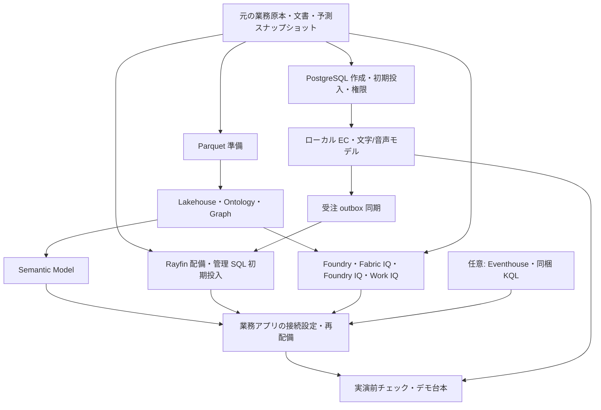

# 実際のデータで構築してデモを実演する

## サマリー

**このリポジトリだけで、元ディレクトリのデータを使ってデータ基盤・PostgreSQL・Rayfin・Semantic Model・Foundry/IQ を順に構築し、既存 2 アプリからデモ台本へ進むための手順です。** 自動処理がある工程は同梱スクリプトを使い、それ以外はポータル操作を明記します。全サービスを一括配備するコマンドではありません。

本書の整備時には実配備・本番ビルド・CLI テストを行っていません。完了したのは構築用の原本・定義・準備コード・手順の接続です。実行者は各工程の完了条件を確認して次へ進んでください。初期導入の構成は元と同じ **ローカル PC の EC / Node.js / Python と、Fabric 上の業務アプリ**です。顧客向け EC のインターネット公開を追加する手順ではありません。

## 1. 構築順序と前提



| 必要なもの | 用途 |
| --- | --- |
| Node.js 22.12 以上、npm | 既存 2 アプリ。各アプリの lock を使い、依存版を一括更新しない |
| Python 3.12、Azure CLI | データ準備・Fabric 配備・DB 初期投入・同期・EC Agent |
| Azure サブスクリプション、Entra 管理者の協力 | PostgreSQL、Foundry、Search、Storage、認証・同意 |
| Fabric 容量と専用ワークスペース | Lakehouse、SQL、Semantic Model、Ontology、Graph、Fabric Apps。対象プレビューの有効化も確認 |
| Microsoft 365 デモ利用者、専用 SharePoint サイト | Work IQ の文書検索。Copilot Credits などの利用条件を別途確認 |
| SQL 対応クライアント | PostgreSQL 拡張と mssql 拡張、または管理ポータル。同期は ODBC Driver 18 も使用 |

Fabric ワークスペースがなければ、管理者が対象容量を割り当てた専用ワークスペースを作成します。Fabric Apps、Ontology / Graph、Semantic Model Execute Queries のテナント設定を確認します。配備担当者には必要な作成・更新権限、実演者には利用アイテムとデータの読取り権限を付与します。課金・プレビュー・データ処理リージョンを確認してから資源を作成してください。[S1]

以降のコマンドの作業位置は **この accelerator のルート**です。元の Playground は不要です。`<...>` は必ず新環境の値に置き換えます。シークレットをチャット・Git・`VITE_` 設定へ保存しません。

## 2. データを固定する

| 元と同じ資産 | 同梱場所 | 使用先 |
| --- | --- | --- |
| 商品・店舗・供給会社 | [catalogue.json](../scenarios/micro-coffee/data/catalogue.json) と [EC カタログ](../apps/storefront/data/catalogue.json) | EC と PostgreSQL |
| 顧客・受注・レビュー・供給履歴 | [operations.json](../scenarios/micro-coffee/data/operations.json) | Lakehouse / DAX / 供給 Ontology |
| 開発商品・材料・配合・在庫・引当 | [development.json](../scenarios/micro-coffee/data/development.json) | Lakehouse / DAX / 開発 Ontology、7 マスターは Rayfin にも投入 |
| 配分シナリオ | [allocation.json](../scenarios/micro-coffee/data/allocation.json) | Rayfin の Allocation 5 テーブル |
| アンケート・SNS・会話・感情 | [シナリオ一覧](../scenarios/micro-coffee/README.md) の各 JSON | 顧客の声の分析 |
| 学習済み予測の固定値 | [predictions.json](../scenarios/micro-coffee/data/predictions.json) | 3 つの gold テーブル。再学習しない |
| 元の ML 入力 | [summary.json](../scenarios/micro-coffee/ml-data/summary.json) と同じフォルダーの CSV / Parquet / JSON | 学習データの由来確認。標準構築では再学習しない |
| 規定 3 件・会議 3 件 | [Foundry/IQ 手順](../infra/foundry/README.md) の原本一覧 | Blob / Search と SharePoint / Work IQ |
| 2 つの意味定義 | [development.json](../scenarios/micro-coffee/ontology/development.json)、[supply.json](../scenarios/micro-coffee/ontology/supply.json) | Ontology / Graph |
| RTI スキーマ・関数 | [DatabaseSchema.kql](../infra/fabric/rti/DatabaseSchema.kql) | Eventhouse |

出典と SHA256 は [sources.lock.json](../scenarios/micro-coffee/sources.lock.json)、追加移植は [setup-assets.json](provenance/setup-assets.json) に記録しています。データの値、業務 ID、null、日時、金額、文書本文は差し替えません。準備処理は原本のハッシュが変わると停止します。通常の構築で移植用の `import_apps.py` を再実行する必要はありません。

変更するのは配備先のリソース ID・接続 URL・権限です。Rayfin の主キー UUID は元の投入処理と同じ UUID5 方式で新 SQL Database ID から生成しますが、`businessId` と業務上の参照 ID は元のままです。分析日時は同じ時刻を UTC へ正規化します。予測原本に残る旧 workspace / lakehouse ID は**出典情報**であり、接続先には使いません。

元のクラウド DB にしか存在しない個人の会話、Graph キャッシュ、保存済み試算、移植後に発生した受注は、ディレクトリの原本には含まれません。これらを架空の履歴で補いません。新環境では操作によって新しい履歴が作られます。世界銀行価格は元の業務データとは別の公開参照データであり、店舗の仕入価格へ置換しません。

## 3. ローカル依存と設定ファイル

```powershell
npm run setup:apps
python -m venv .venv
.venv/Scripts/python.exe -m pip install -r scripts/requirements.txt
```

[config/fabric.example.json](../config/fabric.example.json) を基に `config/environments/demo.json` を作り、`environment`、`tenantId`、`workspaceId` を指定します。`includeOntology` は `true` にします。environment は新規作成用の名前です。同名の既存資源を勝手に採用しません。

各アプリの `.env.example` を基に、それぞれ `.env` を作ります。現段階で未確定の ID は空欄のままにし、以下の順序で埋めます。元環境の `.env`、配備記録、資格情報はコピーしません。

## 4. Lakehouse・Ontology・Graph

元画面と同じ予測も含める標準構成は **29 テーブル**です。元の 26 テーブルに固定予測 3 テーブルを加えます。

```powershell
.venv/Scripts/python.exe scripts/deploy.py prepare --include-predictions
```

公開価格も加える場合は、同じコマンドに次を追加します。この場合は **30 テーブル**です。

```text
--reference-data scenarios/micro-coffee/reference-data/world-bank-coffee/202001-202512-9fdcfa8a2aed9a1b
```

出力された `package_path` と、その中の `package.json` を記録します。予測の行数は `gold_shipment_risk=500`、`gold_demand_forecast=2016`、`gold_bean_depletion=4` です。数値を作り直すための学習処理は実行しません。`--include-predictions` を省略した 26 テーブル構成は、予測表示を省く場合だけ使います。

```powershell
.venv/Scripts/python.exe scripts/deploy.py plan --config config/environments/demo.json --package artifacts/packages/<contentId>
az login --tenant '<tenant-id>' --allow-no-subscriptions
.venv/Scripts/python.exe scripts/deploy.py apply --plan artifacts/plans/<planHash>.json --approve-plan '<planHash>' --confirm-synthetic
```

`apply` は課金対象になり得るクラウド書込みです。計画の対象・件数・内容を承認してから実行します。途中失敗時は [データ基盤手順](data-foundation.md) の `resume` と状態記録を使います。同名資源を削除してやり直す手順ではありません。

完了後の出力は `artifacts/deployments/<deploymentId>/` です。`state.json` の `ontologies` から開発・供給の Ontology ID を記録し、`runtime.public.json` から `lakehouseId`、`graphs.development`、`graphs.supply` を記録します。`semanticModelId` と `rayfinItemId` が null、`applicationReady` が false なのは、この CLI が後続アプリ工程を管理しないためです。

## 5. Semantic Model を作る

1. Fabric ポータルで前節の Lakehouse を開き、**SQL analytics endpoint** に切り替えます。`package.json` の `tables[].name` にある全テーブルが見えるまでメタデータの反映を確認します。
2. **New semantic model** を選び、新しいモデル名と対象ワークスペースを指定します。元と同じ方式にする場合は **Direct Lake on SQL** を選びます。現在のポータルはアクセスモードによって Direct Lake on OneLake が既定になることがあるため、方式を確認します。[S2]
3. 下表の 29 テーブルを選択して作成します。公開価格を使う場合はさらに `mc_ref_world_bank_coffee_prices` を選びます。モデル上のテーブル名と列名を変更せず、列を非表示・除外にしません。

| 区分 | テーブル |
| --- | --- |
| 供給 11 | `mc_v3_supply_products`、`stores`、`suppliers`、`customers`、`orders`、`orderLines`、`reviews`、`reviewTopics`、`serviceFeedback`、`shipments`、`supplyImpacts`。後ろ 10 件にも `mc_v3_supply_` を付ける |
| 開発 10 | `mc_v3_development_products`、`materials`、`origins`、`suppliers`、`facilities`、`recipes`、`recipeLines`、`plans`、`reservations`、`stocks`。後ろ 9 件にも `mc_v3_development_` を付ける |
| 声・会話・メタデータ 5 | `mc_v3_voices`、`mc_v3_conversations`、`mc_v3_messages`、`mc_v3_sentiments`、`mc_v3_metadata` |
| 予測 3 | `gold_shipment_risk`、`gold_demand_forecast`、`gold_bean_depletion` |

4. モデルのデータソース接続を、新 Lakehouse の SQL analytics endpoint に設定します。SSO を使用する場合は、実演者が元データも読めるようにします。固定 ID 接続を選ぶ場合は、その ID のソース権限を設定します。[S3]
5. **Manage permissions** で実演者へモデルの **Read / Build** を付与し、テナントの **Semantic Model Execute Queries REST API** を有効化します。モデル ID を記録して `VITE_SEMANTIC_MODEL_ID` へ設定します。[S1]
6. モデルの **Refresh now** を実行します。Direct Lake のフレーム更新が完了してからアプリへ接続します。後から予測テーブルを追加した場合も、表の追加とモデル更新を両方行います。

現在の業務アプリは各テーブルへ `EVALUATE '<table>'` を送り、結合と業務計算をアプリ内で行います。この経路の再現に、別の DAX メジャーや新しいリレーションシップを発明する必要はありません。列の定義は [table-schemas.json](../scenarios/micro-coffee/table-schemas.json)、予測の列は [connection-config.ts](../apps/operations/src/connection-config.ts) と準備コードにあります。日時列の UTC 化に合わせて `VITE_ANALYTICS_TIMESTAMP_OFFSET=+00:00` を使用します。

## 6. PostgreSQL を作る

[PostgreSQL の構築・初期投入・権限](../apps/storefront/postgres/README.md) を上から実施します。ここで作るものはサーバー、空 DB、元の DDL / 商品 seed、Entra 利用者、EC 実行用と同期用の権限です。完了時に PG 接続情報と、商品 18・店舗 6・供給会社 5 の初期投入結果が揃います。

EC 用 `.env` に設定して `npm run dev:storefront` で起動し、**データ設定 → PostgreSQL** で商品を表示します。この段階で分析用の過去注文や架空の EC 注文を追加する必要はありません。

## 7. Rayfin と初期業務データ

### アプリとスキーマを配備する

[rayfin.yml](../apps/operations/rayfin/rayfin.yml) の名前と許可するリダイレクト URI を確認します。Functions は元と同じ `enabled: false` のままです。業務アプリ配下で対象テナント・ワークスペースを選んで配備します。

```powershell
Push-Location apps/operations
npx rayfin login
npx rayfin up
Pop-Location
```

`--force` は使いません。対話で選択する配備先が第 4 節と同じ workspace であることを確認します。Rayfin の配備結果とローカル `rayfin/.deployments.json` から、AppBackend の Item ID、API URL、publishable key、hosting URL を記録します。publishable key はブラウザー用の公開キーであり、サービスシークレットではありません。

**その AppBackend が実際に参照する SQL Database** を Fabric ポータルの依存資源・設定から開き、SQL Database の Item ID、SQL 接続先の database name、server FQDN を記録します。表示名だけで同じワークスペースの別 DB を選ばないでください。SQL analytics endpoint、Lakehouse、AppBackend の ID と SQL Database Item ID は別です。新 DB に [schema.ts](../apps/operations/rayfin/data/schema.ts) のエンティティが作成されていることを確認します。

### 元データの投入 SQL を作る

ルートから次を実行します。ネットワーク接続や SQL 実行はしません。

```powershell
python scripts/prepare_application.py --sql-database-id '<rayfin-sql-database-item-id>' --database-name '<database-name>' --output artifacts/rayfin-initial
```

生成される `rayfin-seed.sql` を mssql 拡張などで開き、**記録した管理 SQL DB** に Entra の構築担当者として接続して、一つのバッチとして実行します。`manifest.json` に投入件数・原本ハッシュ・対象を保存します。

| 投入対象 | 元の原本 |
| --- | --- |
| Origins / Suppliers / Materials / Facilities / Products / Recipes / RecipeLines | development の origins / suppliers / materials / facilities / products / recipes / recipeLines |
| AllocationCustomers / AllocationOrders / AllocationOrderLines / AllocationStocks / AllocationScenarios | allocation の customers / orders / orderLines / stocks とシナリオ情報 |

この SQL は DB 名を確認し、12 テーブルがすべて空の場合だけトランザクション内で投入します。既存行があれば停止し、上書き・削除しません。成功後の再実行は不要です。中途失敗でロールバックされた場合は原因を解決し、同じ対象と SQL で再実行します。

開発の plans / reservations / stocks は DAX 側、分析用の過去注文・顧客は供給テーブル側に残します。WorkspaceRecord、会話、Graph キャッシュ、EcOrders 系はこの初期 seed へ混ぜません。EC の実行後に必要な商品・顧客・受注が同期で追加されます。

### 同期担当者の SQL 権限

同期担当者には Fabric の対象 SQL Database の **Read** アイテム権限を与え、管理 API で接続情報を取得できるようにします。SQL の構築担当者が、その DB で次を実行します。既にユーザーが存在する場合は CREATE USER を繰り返しません。[S4]

```sql
CREATE USER [<sync-runner-upn>] FROM EXTERNAL PROVIDER;
CREATE ROLE maikuro_order_sync;
GRANT SELECT, INSERT, UPDATE ON dbo.EcOrders TO maikuro_order_sync;
GRANT SELECT, INSERT, UPDATE ON dbo.EcOrderLines TO maikuro_order_sync;
GRANT SELECT, INSERT, UPDATE ON dbo.EcProducts TO maikuro_order_sync;
GRANT SELECT, INSERT, UPDATE ON dbo.EcCustomers TO maikuro_order_sync;
ALTER ROLE maikuro_order_sync ADD MEMBER [<sync-runner-upn>];
```

Read アイテム権限と SQL の DML 権限は別です。ブラウザーは Rayfin の認証・エンティティ権限を使い、同期担当者の SQL トークンを受け取りません。

## 8. Graph とアプリの認証

1. Entra で業務ブラウザー用の単一テナント SPA を登録し、実際の hosting origin の `/auth.html` を **Single-page application** の redirect URI に登録します。ローカル確認を使う場合だけ、その origin も個別登録します。シークレットを発行してブラウザーへ渡す構成ではありません。
2. アプリが要求する Fabric API の委任スコープ `https://api.fabric.microsoft.com/Item.Read.All` と、Foundry 用 `https://ai.azure.com/user_impersonation` に必要な API 権限・利用者または管理者同意を構成します。利用者に対象 Graph / Ontology / データを読む権限も付与します。
3. `VITE_ENTRA_TENANT_ID`、`VITE_ENTRA_CLIENT_ID`、`VITE_DEVELOPMENT_GRAPH_ID`、`VITE_SUPPLY_GRAPH_ID` を設定します。Graph ID は第 4 節の `runtime.public.json` の値です。
4. Rayfin の `allowedRedirectUris` に実際の hosting origin と必要なコールバックだけがあることを確認します。MSAL の `/auth.html` と Rayfin の `/auth/callback` を同じ設定とみなしません。

ブラウザーは Graph / Foundry のサインインで、現在の Fabric セッションと同じテナント・利用者であることを確認します。DAX は別の MSAL 接続を作らず、Fabric ホストの認証を利用します。[S1] [S5]

## 9. Foundry・IQ・EC の AI

[Foundry/IQ 構築手順](../infra/foundry/README.md) を実施します。元文書の掲載、Search の取り込み、Work IQ、開発・供給の Fabric IQ、Agent 作成要求の生成、作成、版固定までを含みます。`config/foundry.example.json` を埋めるだけではなく、手順の資源・接続作成も必要です。

EC の文字相談は別の Python Agent です。[EC 手順](../apps/storefront/README.md) に従って app 内の `.venv` と依存を用意し、ツール呼出し対応モデルの実デプロイを `BARISTA_AGENT_ENDPOINT` / `BARISTA_AGENT_DEPLOYMENT` へ設定します。Azure 側の呼出し利用者には選択したモデル API に必要な権限を付与します。業務 Data Copilot の Agent 名を、このモデルデプロイ名へ流用しません。

音声を使う場合は Azure OpenAI で対応する Realtime モデルをデプロイし、`AZURE_OPENAI_ENDPOINT` と `AZURE_OPENAI_DEPLOYMENT_NAME` を設定します。ブラウザーのマイク許可とサーバーの認証設定を確認します。GPT-Live + Jev は元アプリの任意経路です。利用契約とデプロイを用意して `AZURE_GPT_LIVE_*`、`TYPESAFE_API_KEY` をサーバー側へ設定した場合だけ `VOICE_LIVE_JEV_ENABLED=true` にします。文字・Realtime・GPT-Live を未設定時の模擬成功で置き換えません。[S6]

## 10. RTI を使う場合

元の業務アプリ内送信機能と、無変更で移植した [DatabaseSchema.kql](../infra/fabric/rti/DatabaseSchema.kql) を使います。固定予測と異なり、送信時刻を基準に新しい合成イベントを作る機能です。元の実 SNS 投稿や過去のクラウドイベントを復元するものではありません。

1. Fabric ワークスペースの **New item → Eventhouse** で専用 Eventhouse を作成します。同時に作られる KQL Database を開きます。[S7]
2. その DB に接続した KQL Queryset で、同梱 KQL の管理コマンドを上から順に実行します。テーブル、JSON マッピング、更新ポリシー、保持、`SocialVoiceLatest()` / `SocialVoiceWindow()` 等の関数を作成します。別の共有 DB には適用しません。
3. DB の詳細から **Query URI** と DB 名を記録し、`VITE_RTI_QUERY_URI` / `VITE_RTI_DATABASE` へ設定します。Ingestion URI と Query URI を混同しません。
4. 実演者へ DB の読取り権限と、`SocialVoiceIngress` の Table Ingestor 権限を付与します。SPA が要求する Kusto の委任認証・同意も完了します。元アプリのスコープ選択は [rti-client.ts](../apps/operations/src/rti-client.ts) にあります。
5. 画面を再配備後、顧客の声のライブ表示から Eventhouse にサインインし、既存の 4 幕の送信操作を順に実行します。通常 10 件、否定急増 10 件、連続急増 10 件、回復 30 件です。固定の過去日付へ改変しません。

アプリ内送信は `.ingest inline` による Eventhouse 直接投入です。この経路では Eventstream は不要です。元 KQL の streaming ingestion 無効設定を、理由なく有効化しないでください。外部プロデューサーを使う Eventstream 経路を選ぶ場合は、Custom endpoint → Eventhouse / `SocialVoiceIngress` / JSON mapping `social_voice_json_v1` を構成し、元と同じイベントスキーマを送ります。アプリ内の送信を Eventstream 経由の実演と説明しません。[S8]

## 11. 設定をそろえて最終配備

業務アプリの [設定ひな形](../apps/operations/.env.example) へ次の対応で値を設定します。これらはビルド時に取り込まれるので、値を変えたら再配備します。

| 設定 | 取得元 |
| --- | --- |
| `VITE_RAYFIN_API_URL` / `VITE_RAYFIN_PUBLISHABLE_KEY` | Rayfin 配備結果の API URL / 公開キー |
| `VITE_FABRIC_WORKSPACE_ID` / `VITE_FABRIC_ITEM_ID` | 対象 workspace / AppBackend ID |
| `VITE_SEMANTIC_MODEL_ID` | 第 5 節で作成したモデル ID |
| `VITE_ANALYTICS_TIMESTAMP_OFFSET` | 本準備コードでは `+00:00` |
| `VITE_DEVELOPMENT_GRAPH_ID` / `VITE_SUPPLY_GRAPH_ID` | 第 4 節の GraphModel ID |
| `VITE_ENTRA_TENANT_ID` / `VITE_ENTRA_CLIENT_ID` | 業務ブラウザー用 SPA |
| `VITE_FOUNDRY_PROJECT_ENDPOINT` / `AGENT_NAME` / `AGENT_VERSION` | Foundry の新環境の値。後ろ 2 件にも `VITE_FOUNDRY_` を付ける |
| `VITE_FOUNDRY_AUTO_APPROVE_MCP` | Foundry 手順の承認条件を満たす読取り専用デモでは `true` |
| `VITE_RTI_QUERY_URI` / `VITE_RTI_DATABASE` | RTI を使う場合だけ新 KQL DB の値 |

```powershell
Push-Location apps/operations
npx rayfin up
npx rayfin up staticapp deploy
Pop-Location
npm run dev:storefront
```

`rayfin up` の後、設定変更済みの静的画面が確実に反映されるよう `up staticapp deploy` を明示します。構築時のビルドは配備工程に含まれますが、この資料作成時には実行していません。

業務画面は **Fabric ポータル内の App アイテム**から開きます。DAX 接続の確認に単独 hosting URL やローカル Vite URL を使いません。EC は起動ログにある loopback URL の `/shop` を開きます。[S1]

## 12. 注文・同期・デモ進行

1. 初期値の確認を先に行います。顧客の声の PRD-002 は全対象期間・全店舗・全情報源で 62 件、配合 A は 100 袋で豆原価 470 円/袋、B は 608 円/袋です。B の 200 袋では ET が 12 kg 不足します。分析原本の供給履歴は 5 便・33 注文です。配分用の注文や新規 EC 注文を、過去履歴の 33 件に含めません。
2. EC の PostgreSQL モードでデモ注文を確定し、注文番号を記録します。この操作から先は新しいデモ実行データです。
3. [受注同期手順](../services/order-sync/README.md) の依存・ODBC・権限を整え、新 workspace / SQL Database Item ID を指定して `sync.py --apply` を実行します。別の DB へ向けないでください。
4. 業務画面を再読込みし、同じ受注番号・商品・数量・金額・状態を確認します。受取処理後に再同期した場合は状態の更新を確認します。同期は Rayfin 管理 SQL までであり、Lakehouse / DAX / Graph / 顧客の声を自動更新しません。
5. [実演マニュアル](../scenarios/micro-coffee/demo/README.md) の登壇前チェックを行い、約 25 分の本編へ進みます。新しい注文の件数と固定原本の期待値は別に説明します。

| 確認地点 | 次へ進む条件 |
| --- | --- |
| データ準備 | 原本の版・ハッシュ、29 または 30 テーブルのマニフェストを保存 |
| Fabric | 対象 Lakehouse、Ontology、Graph と定義・データの対応を確認 |
| Semantic Model | 全対象表が存在し、実演者が DAX 経由で読める |
| Rayfin | 12 初期テーブルの件数が生成マニフェストと一致し、画面で原値を表示 |
| PostgreSQL | 18 商品・6 店舗・5 供給会社が一致し、注文 API で保存できる |
| 同期 | 新規 EC 注文の業務 ID・明細・状態が Rayfin と対応 |
| IQ | 会議・規定・構造化データへの実ツール呼出しと引用原文が対応 |
| 当日 | 使用モード、利用者、Agent 版、基準日時を固定し、台本の条件を確認 |

これらは構築後に実行者が確認する項目で、この手順の作成だけで達成済みとは扱いません。

## 13. 中断・復旧・片付け

Fabric の途中失敗は `state.json` と同じ計画で `resume` します。Rayfin の schema 失敗はエラーを解消して通常の `rayfin up` を行い、`--force` で回避しません。SQL seed は初回限定、PG seed も空マスター限定です。同期失敗では outbox を消さず、同じ宛先へ再実行します。IQ は同じ名前への結果不明 POST を再送せず、作成結果をポータルで確認します。

次回用に contentId、planHash、各アイテム ID、Agent 版、初期投入マニフェスト、資料掲載 URL を Git 管理外で保存します。資格情報は記録しません。終了後は EC のプロセスを止め、費用を確認し、不要な**専用**資源だけを所有者の承認で停止・削除します。共有容量・共有 Search・他者の DB を削除しません。Eventhouse の削除は子 KQL DB も削除します。ブラウザーを閉じてもクラウド資源は停止しません。[S7]

## 公式資料

参照日: 2026-09-28。

- S1: Fabric Apps の DAX 接続・権限・ポータル内実行 https://learn.microsoft.com/fabric/apps/data-apps-template
- S2: Direct Lake モデル作成 https://learn.microsoft.com/fabric/fundamentals/direct-lake-develop
- S3: Direct Lake の認証・ソース権限 https://learn.microsoft.com/fabric/fundamentals/direct-lake-security-integration
- S4: Fabric SQL の Entra ユーザー https://learn.microsoft.com/fabric/database/sql/authentication
- S5: Fabric Apps の認証 https://learn.microsoft.com/fabric/apps/fabric-authentication
- S6: Realtime の設定 https://learn.microsoft.com/azure/foundry/openai/how-to/realtime-audio
- S7: Eventhouse 作成 https://learn.microsoft.com/fabric/real-time-intelligence/create-eventhouse
- S8: Eventstream / Eventhouse 接続 https://learn.microsoft.com/fabric/real-time-intelligence/event-streams/api-kusto-pull-destination

[S1]: https://learn.microsoft.com/fabric/apps/data-apps-template
[S2]: https://learn.microsoft.com/fabric/fundamentals/direct-lake-develop
[S3]: https://learn.microsoft.com/fabric/fundamentals/direct-lake-security-integration
[S4]: https://learn.microsoft.com/fabric/database/sql/authentication
[S5]: https://learn.microsoft.com/fabric/apps/fabric-authentication
[S6]: https://learn.microsoft.com/azure/foundry/openai/how-to/realtime-audio
[S7]: https://learn.microsoft.com/fabric/real-time-intelligence/create-eventhouse
[S8]: https://learn.microsoft.com/fabric/real-time-intelligence/event-streams/api-kusto-pull-destination